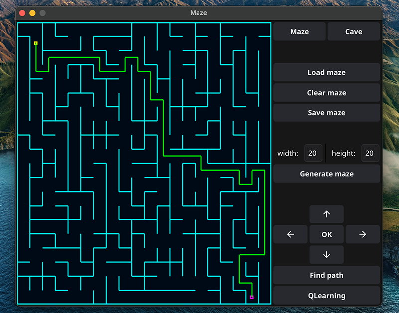
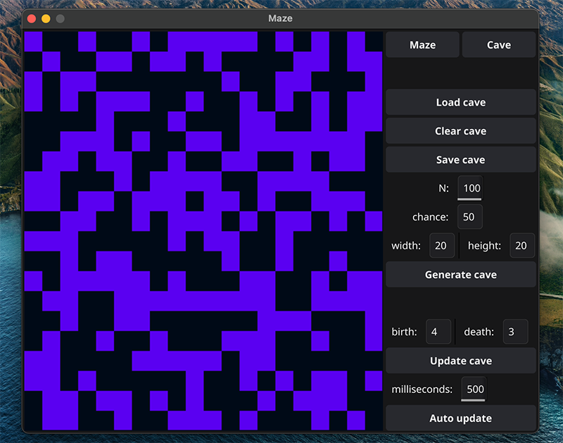

<p align="center">
  <a href="https://docs.fyne.io"></a>

# Описание программы Maze
#
Программа разработана на языке Golang. Использован инструментарий для создания графических приложений [Fyne](https://fyne.io/)

Программа позволяет загружать из файлов, генерировать и отрисовывать идеальные лабиринты и пещеры. Есть возможность показать решение любого лабиринта, который в реальном времени изображен на экране,
а также обучить агента находить выход из лабиринта используя метод Q-обучения и взаимодействовать с агентом.

### Зависимости:

golang v 1.21.6

### Установка
```
$ make install
```
### Удаление
```
$ make uninstall
```

## Главное окно приложения Maze


Используйте кнопки "Load maze" или "Generate maze" с параметрами размера лабиринта, чтобы отобразить лабиринт на экране приложения

### Описание лабиринта

Лабиринт может храниться в файле в виде количества строк и столбцов, а также двух матриц, содержащих положение вертикальных и горизонтальных стен соответственно. 
В первой матрице отображается наличие стены справа от каждой ячейки, а во второй - снизу.

**Пример подобного файла:*
```
4 4
0 0 0 1
1 0 1 1
0 1 0 1
0 0 0 1

1 0 1 0
0 0 1 0
1 1 0 1
1 1 1 1
```

**Лабиринт, описанный в этом файле:* \


## Чтобы показать решение любого лабиринта, который сейчас изображен на экране:

Кнопками со стрелками навигации выберите расположение начальной точки и подтвердите его кнопкой "OK"

Далее выберите и подтвердите кнопкой "OK" расположение конечной точки маршрута в лабиринте

Hажмите кнопку "Find path"

Теперь при работе с кнопками навигации решение лабиринта исчезнет и появится возможность выбора новой начальной точки.

## Чтобы обучить агента находить выход из лабиринта:

**Файл с данными для обучения должен содержать лабиринт и координаты конечной точки:*
```
10 10
0 0 1 0 0 0 0 1 0 1
0 1 1 1 0 0 0 1 1 1
1 0 1 0 0 1 1 1 1 1
1 0 0 1 0 0 1 0 1 1
0 0 1 0 1 0 1 0 1 1
1 0 0 0 0 1 1 0 1 1
0 0 0 1 1 0 0 1 0 1
0 0 0 0 1 0 1 1 0 1
1 0 0 0 1 1 1 0 0 1
0 1 0 1 0 1 0 0 0 1

0 1 0 0 0 1 1 1 0 0
1 1 0 0 1 1 1 0 0 0
0 0 1 1 1 0 0 0 0 0
0 1 1 0 0 1 0 0 1 0
1 0 1 1 1 0 1 1 1 0
0 1 1 1 0 1 0 0 0 0
1 1 0 1 0 0 1 0 1 1
0 1 1 1 1 0 0 0 1 0
1 0 1 0 0 0 0 1 1 1
1 1 1 1 1 1 1 1 1 1

9 9

```
**В конце файла обязательно пустая строка*

Hажмите "QLearning" и найдите в появившемся окне файл с данными нужного формата

Если нажать "Cancel", то для обучения программа возьмет лабиринт отображаемый в реальном времени на экране, а в качестве конечной точки - индексы [0][0] матрицы лабиринта (если ранее загружались данные с конечной точкой - то индексы предыдущей конечной точки).

**Агент обучается на одном лабиринте, который не меняется ни в процессе обучения, ни на этапе тестирования. Конечная точка также фиксирована.*

После этапа выбора файла, выберите начальную точку и подтвердите ее местоположение кнопкой "OK". Нажмите снова кнопку "QLearning" для начала обучения агента (в зависимости от размера лабиринта, это может занять до нескольких минут).

Когда процесс обучения звершится - на экране отобразится первый результат

Далее тестируйте агента, выбирая новую начальную точку и подтвердив кнопкой "OK" нажимайте на "QLearning".

После второго подряд нажатия кнопки "QLearning" - появляется окно выбора файла и агент переобучится, если действовать по инструкции описанной выше.

## Для работы с пещерами:

Чтобы переключаться между меню Maze (лабиринты) и Cave (пещеры) используйте однименные кнопки


### Описание пещер

Пещера хранится в файле в виде количества строк и столбцов, 
а также матрицы, содержащей положение «живых» и «мертвых» клеток.

**Пример подобного файла:*
```
4 4
0 1 0 1
1 0 0 1
0 1 0 0
0 0 1 1
```

**Пещера, описанная в этом файле:* \


Для генерации пещер, кроме размеров дополнительно задаются еще два параметра - "N" и "chance" (шанс появления живой клетки из N случаев)


После загрузки или генерации пещеры при нажатии на кнопку "Update cave" происходит следующий шаг и отрисовывается очередная итерация работы алгоритма, для которого задаются пределы «рождения» и «смерти» клетки (birth и death).

Для "Auto update" есть параметр частоты отрисовки итераций "milliseconds" в миллисекундах.